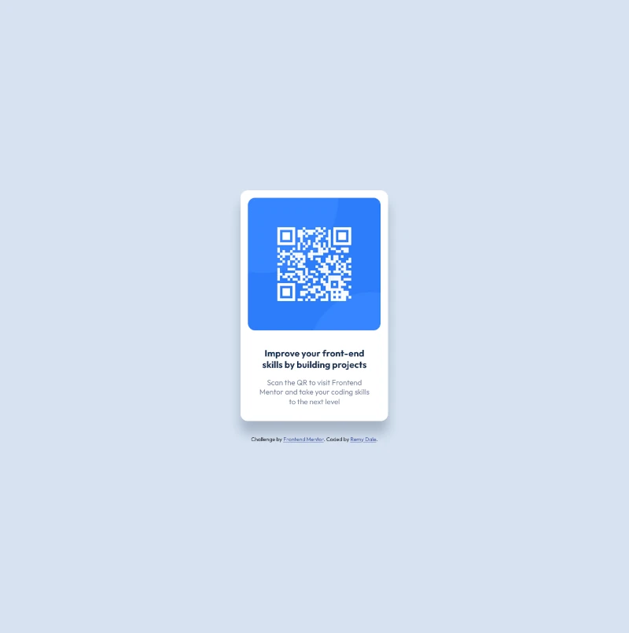

# Frontend Mentor - QR code component solution

This is a solution to the [QR code component challenge on Frontend Mentor](https://www.frontendmentor.io/challenges/qr-code-component-iux_sIO_H). Frontend Mentor challenges help you improve your coding skills by building realistic projects. 

## Table of contents

- [Overview](#overview)
  - [Screenshot](#screenshot)
  - [Links](#links)
- [My process](#my-process)
  - [Built with](#built-with)
  - [What I learned](#what-i-learned)
  - [Continued development](#continued-development)
- [Author](#author)

## Overview
This is a simple QR code card linking to Front-end Mentors

### Screenshot




### Links

- Solution URL: [Add solution URL here](https://your-solution-url.com)
- Live Site URL: [Add live site URL here](https://your-live-site-url.com)

## My process

- Using BEM I identified containers and pieces for easy styling
- I took advantage of custom CSS properties to make the card easy to update
- I then started at the root element and built the card from the background out towards the user.

### Built with

- Semantic HTML5 markup
- CSS custom properties
- Flexbox
- Mobile-first workflow

### What I learned

This project was a project that I used in order to strengthen my grasp of semantic HTML, CSS, BEM Architecture, and Custom CSS Properties.

I learned that by using custom properties in css I can add an alpha channel to values, but only if the property that I am adding them to does not include the hsl() format. Instead it must be the values themself.

```css
:root {
  --hsl-values: 218, 44%, 22%;
  --hsl: hsl(var(--hsl-values));
  --hsla: hsla(var(--hsl-values), 0.25)
}
```

### Continued development

In the future I plan on incorporating SCSS into my design process to speed up my workflow.

## Author

- Website - [Remy Dale](https://www.remydale.com/)
- Frontend Mentor - [@TheRemyD](https://www.frontendmentor.io/profile/TheRemyD)
- Twitter - [@TheOnlyRemyD](https://www.twitter.com/TheOnlyRemyD)